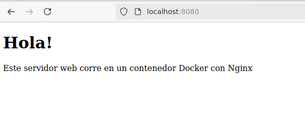

# Instalación de un servidor web con Docker Compose:
---
1. Crear el proyecto.
1. Crear el archivo **docker-compose.yml** con el siguiente contenido:

```yaml
version: "3.8"
services:
  web:
    image: nginx:latest   # Imagen oficial de Nginx
    ports:
      - "8080:80"         # Exponemos el puerto 80 del contenedor al 8080 de la máquina
    volumes:
      - ./html:/usr/share/nginx/html   # Montamos nuestra carpeta local como contenido del servidor
```

## ¿Qué hace cada cosa?
- **version:** especifica la versión de *docker-compose*.
- **services:** define los contenedores, en este caso *web*.
- **image:** indica la imagen que se va a usar, en este caso *nginx*.
- **ports:** mapea el puerto **8080** de nuestra maquina al puerto **80** del contenedor.
- **volumes:** enlaza la carpeta local **./html** con la ruta donde nginx busca los archivos web **(/usr/share/nginx/html)**.
---
3. Crear la página de inicio **(index.html)**:

```html
<!DOCTYPE html>
<html lang="es">
<head>
    <meta charset="UTF-8">
    <meta name="viewport" content="width=device-width, initial-scale=1.0">
    <title>Servidor web con Docker</title>
</head>
<body>
    <h1>Hola!</h1>
    <p>Este servidor web corre en un contenedor Docker con Nginx</p>
</body>
</html>
```
---
4. Levantar el servidor:
```bash
docker-compose up
```
- Descarga la imagen oficial de **nginx**.
- Levanta el servidor con nuestra configuración.
- Muestra los archivos de **html/** en http://localhost:8080.
---


